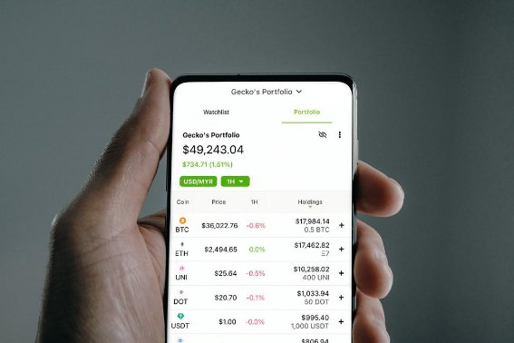
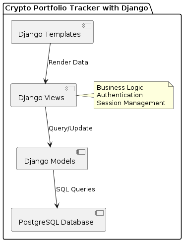
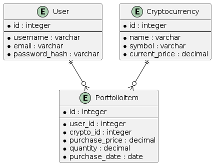
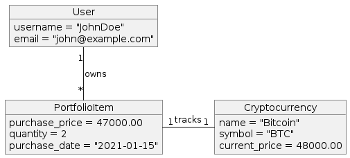


# Title

Crypto Portfolio Tracker

 Architecture Requirments and Design Document

***Contributors***

**[ Chi Che  - Uba23EP052]**

**[ Novala Derick -]**

**[Yusuf ]**

**[Huber ]**

1. # Background

The Crypto Portfolio Tracker is designed to help investors track and manage their cryptocurrency investments. As new cryptocurrency projects are continuously emerging, investors need a reliable system to monitor their investments, track real-time market prices, and evaluate their portfolio's performance. This application aims to provide a clear, user-friendly interface for managing cryptocurrency assets, tracking gains and losses, and making informed investment decisions.

1. # Requirements

1. # Functional Requirements

Functional requirements specify what the system should do. They define the core functionalities that the Crypto Portfolio Tracker must perform:

- User Management:
  - Users must be able to register an account with an email, username, and password.
  - Users must be able to log in and log out of their accounts.
- Portfolio Management:
  - Users must be able to add cryptocurrencies to their portfolios by specifying the type of cryptocurrency, quantity, and purchase price.
  - Users must be able to view a list of all cryptocurrencies they have added to their portfolios.
  - Users must be able to enter and update the buy price of cryptocurrencies.
- Price Tracking:
  - The system must provide real-time price updates for cryptocurrencies in the user's portfolio.
  - Users must be able to view the current price of each cryptocurrency.
- Profit and Loss Calculation:
  - The system must calculate and display the profit or loss for each cryptocurrency based on the purchase price and the current market price.
  - Users must be able to view a summary of overall profit and loss for their entire portfolio.

1. ## Non-Functional Requirements

Non-functional requirements describe how the system performs certain operations and qualities the system should have:

- Performance:
  - The system should display the updated prices of cryptocurrencies within seconds of real-time price changes.
  - The system must handle up to 1000 concurrent users without performance degradation.
- Security:
  - User data, including portfolio details, must be securely stored using encryption.
  - The system must implement secure authentication and authorization to ensure users can only access their portfolio information.
  - Input validation and data sanitization must be employed to prevent common security threats like SQL injection and cross-site scripting (XSS).
- Usability:
  - The user interface must be intuitive and easy to navigate for users without prior technical knowledge.
  - The system should be accessible on various devices, including desktops, tablets, and smartphones.
- Reliability:
  - The system should have an uptime of 99.9%, ensuring it is available for users nearly all the time.
  - Regular backups of the database should be conducted to prevent data loss.
- Scalability:
  - The architecture should support scaling to accommodate an increasing number of users and data volume.
- Maintainability:
  - The system should be designed to allow easy updates and maintenance without significant downtime.

1. ## Use Case Diagram

The use case diagram illustrates the interactions available to users of the Crypto Portfolio Tracker. It identifies all the actions a typical user can perform, providing a clear scope of the system's functionality.

1. ## Component Diagram

The component diagram provides an overview of the main components within the application, detailing how the user interface, API layer, and database interact. This diagram is essential for understanding the modular structure of the system and its interdependencies.

1. ## Database Schema

The database schema diagram provides a detailed view of the data structure. It outlines the tables, their fields, and the relationships between them, essential for building and maintaining the database.

1. ## Sequence Diagram

The sequence diagram details the interactions for a user adding a cryptocurrency to their portfolio.

1. ## Class Diagram

The class diagram will depict the structure of the application's models.

1. ## Object Diagram

The object diagram will provide a snapshot of the instance relationships at a particular moment, focusing on the system's runtime state.

1. ## Implementation Steps

The development process will be broken down into sequential phases to ensure clarity and manageability. Here’s how we can proceed:

- Environment Setup:
  - Install Python and Django along with other required packages such as Django REST Framework, Celery, and Redis.
  - Set up a PostgreSQL database.
  - Configure a virtual environment for Python to manage dependencies.
- Project Structure Setup:
  - Create a new Django project and set up the application structure (apps for users, cryptocurrencies, and portfolio management).
  - Configure Django settings for database connections, static files, and security settings.
- Model Implementation:
  - Define the models in Django as per the schema provided earlier (User, Cryptocurrency, PortfolioItem).
  - Run migrations to create database tables.
- API Development:
  - Implement RESTful APIs using Django REST Framework for:
  - User registration and authentication.
  - Managing cryptocurrencies (add, update, delete).
  - Portfolio management (add transactions, view portfolio).
  - Ensure all API endpoints are secured and require authentication.
- Frontend Development:
  - Develop the front end using HTML, CSS, and JavaScript.
  - Optionally, integrate a JavaScript framework like React for a more dynamic interface.
  - Connect the frontend with the backend through RESTful APIs.
- Background Tasks Setup:
  - Set up views to handle background tasks such as fetching the latest cryptocurrency prices.
  - Implement tasks to update the current price in the Cryptocurrency model at regular intervals.
- Testing:
  - Write unit tests for both backend and frontend functionalities.
  - Perform integration testing to ensure all parts of the application work together as expected.
  - Use Django’s testing framework for backend tests.
- Deployment:
  - Prepare the application for deployment.
  - Deploy the application to a production environment, considering a cloud platform like AWS or Heroku.
  - Set up monitoring and logging tools to ensure the application runs smoothly in production.
- Maintenance and Updates:
  - Regularly update the application dependencies and platform.
  - Monitor the application’s performance and make adjustments as necessary.

1. ## Project Milestones

- Milestone 1: Project Setup and Planning (Day 1)
  - Tasks:
    - Set up development environments for each team member.
    - Establish the project repository and branch strategy.
    - Define and assign initial tasks and roles based on skills and project needs.
  - Deliverables:
    - Fully configured development environments.
    - Project repository and documentation setup.
- Milestone 2: Core Backend and Database Setup (Days 2-3)
  - Tasks:
    - Develop the database schema and run initial migrations.
    - Implement core backend models (User, Cryptocurrency, PortfolioItem).
    - Set up basic user authentication and registration APIs.
  - Deliverables:
    - Functional database with core tables.
    - Basic authentication is working.
- Milestone 3: API Development and Integration (Days 4-5)
  - Tasks:
    - Develop APIs for cryptocurrency management and portfolio operations.
    - Begin basic frontend development to interact with these APIs.
  - Deliverables:
    - Core APIs deployed and tested.
    - Initial frontend interactions available.
- Milestone 4: Frontend Development and Advanced Features (Days 6-7)
  - Tasks:
    - Enhance the front end with advanced interactive elements and real-time data fetching.
    - Implement additional features like real-time price updates and profit/loss calculations.
- Deliverables:
  - Advanced frontend functionalities.
  - Backend support for dynamic content.
- Milestone 5: Testing, Refinement, and Deployment (Days 8-10)
  - Tasks:
    - Conduct thorough testing across all components and user flows.
    - Optimize performance and fix any emerging bugs.
    - Prepare and execute deployment to the production environment.
  - Deliverables:
    - Fully functional and bug-free application.
    - Deployed application accessible to users.
    - Roles and Responsibilities

1. ## Cost

The cost for the development of this project is mostly the time we as a team are going to dedicate to see that it's successful apart from that we will need to host the application on a server online which from my prediction can cost us at most $15
